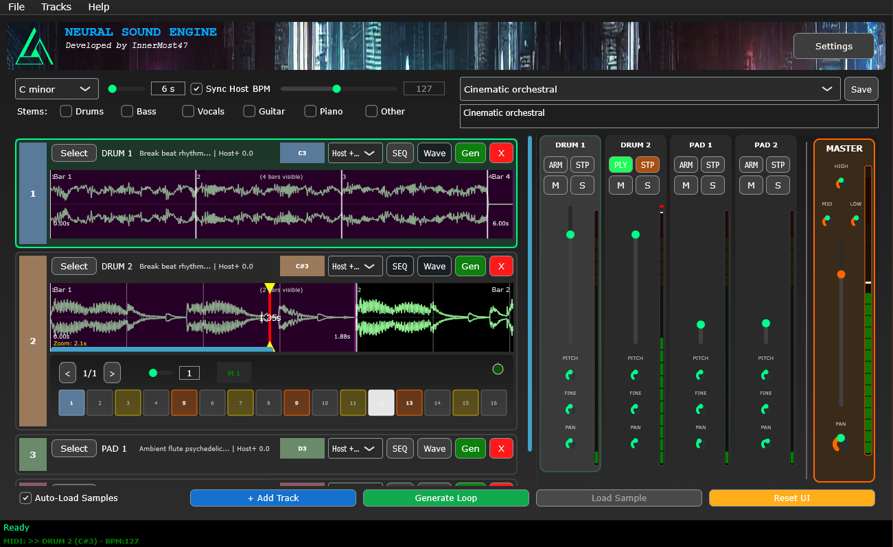

# OBSIDIAN-Neural

🎵 **Real-time AI music generation VST3 plugin for live performance**

OBSIDIAN-Neural transforms AI into a live music instrument using intelligent LLM prompts and Stable Audio Open to create contextually aware loops directly in your DAW.

**🚨 FRUSTRATED WITH INSTALLATION? 🚨**  
**Skip the complexity! Get a free API key instead.**  
**No Python, no compilation, no debugging - just music creation.**  
**⚠️ Limited to 10 testers + queue system during peak hours**

## ⚠️ PRE-RELEASE PROJECT

**OBSIDIAN-Neural is currently in active development.** This is NOT an official v1.0 release. While functional, you may encounter bugs and instabilities. I'm working on this continuously and push updates regularly (sometimes multiple times per day).

**I may have been too enthusiastic** about the installation complexity initially. I'm aware it can be frustrating, and I'm actively working to improve the user experience.

---

## 🎯 QUICK START (Choose Your Path)

### 🚀 **Option 1: Beta Testing (RECOMMENDED for most users)**

**Get FREE API access - No setup required!**

- Contact me for a free API key (**only 10 slots available**, unfortunately I can't provide more from my side)
- **If you have a GPU server and want to share**: the server works with API keys - you can host your own instance!
- Download VST3 from [Releases](https://github.com/innermost47/ai-dj/releases)
- **That's it!** No GPU, no Python, no compilation needed

### 🔧 **Option 2: Windows Installer**

- Download the [.exe installer](https://github.com/innermost47/ai-dj/releases)
- One-click setup (still requires GPU setup)
- Can be combined with manual VST3 copy (uncheck "Build VST3" in installer)

### 👨‍💻 **Option 3: For Developers Only**

- Full source compilation (complex!)
- Only recommended if you're comfortable with Python, CMake, and GPU toolchains

---

## 🤔 Why Server Architecture?

**TL;DR: AI models are MASSIVE and need serious hardware**

### The Reality of Modern AI:

- **Stable Audio Open**: ~4.8GB model size
- **VRAM needed**: 6+ GB minimum
- **Loading time**: 30-60 seconds
- **A normal VST**: 50MB, loads instantly

### This is NOT a limitation - it's MODERN AI

Every AI music tool faces this:

- **Suno**: Server-based
- **Udio**: Server-based
- **Google MusicLM**: Server-based
- **Adobe AI Audio**: Server-based

### Benefits of This Approach:

✅ **Lighter VST** - Fast loading, stable performance  
✅ **Shared resources** - Multiple users, one GPU  
✅ **Better hardware** - Dedicated inference machines  
✅ **Future-proof** - Easy model updates

---

## 🌍 Community-Powered Vision

### 🖥️ **The GPU Problem**

I'm aware that requiring expensive GPUs creates barriers. Many musicians can't afford RTX 4090s just to try AI music generation. The subscription model everywhere is getting ridiculous.

### 🤝 **Seeking Contributors**

I'm researching a **distributed GPU network** where we can:

- Pool our computing resources
- Share GPU power across the community
- Provide **completely free access** to all users
- Redistribute donations to GPU contributors
- Build something truly community-owned

**Got a powerful GPU and want to help?** The server works with API keys - you can host your own instance and share access with the community!

### 💭 **Community Input Welcome!**

Know a better way to handle massive AI models? Have ideas? **Please share!**  
I'm open to alternatives, but client/server is currently the most practical solution for real-time AI music generation.

---

## 🚀 Beta Testing Program

**Testing Period:** Daily 10:00 - 00:00 (French Time)

### 🎯 What I'm Offering

**Only 10 free API keys available** for motivated testers - no GPU required! Generate up to **50 AI samples** using my hosted Stable Audio Open Small model.

### 🤝 What I'm Looking For

- **Bug reports** via GitHub Issues
- **Edge case testing** and unusual workflows
- **User experience feedback**
- **Clear documentation** of any problems

### 📞 How to Apply

**Contact me at: b03caa1n5@mozmail.com**

Include:

- Brief intro about your music/testing background
- What you'd like to explore with OBSIDIAN-Neural
- Commitment to provide constructive feedback

---

## 📥 Installation Notes

### 🔄 Always Use Latest Release

- Check [Releases](https://github.com/innermost47/ai-dj/releases) regularly
- **Always download the highest version number**
- I fix bugs as soon as I find them and push updates frequently
- Some releases may be unstable, but newer = more fixes

### 💾 Manual VST3 Installation

If using the installer + manual VST3:

1. Download both installer and VST3 from Releases
2. Run installer, **uncheck "Build VST3"**
3. Manually copy VST3 to `C:\Program Files\Common Files\VST3\`

---

## 📰 **Press coverage moved to [PRESS.md](PRESS.md)**

---

---

## 🔮 Key Features

### 🤖 Intelligent AI Generation

- **LLM Brain**: Analyzes sessions and generates smart prompts
- **Stable Audio Open**: High-quality electronic music generation
- **Real-time**: Everything happens live for performance use
- **Auto tempo sync**: Matches your DAW automatically

### 🎹 Multi-Track Sampler

- **8 independent tracks** with MIDI triggering (C3-B3)
- **Advanced waveform editor** with zoom and precise loop points
- **Smart time-stretching** with DAW tempo sync
- **Individual outputs** for separate mixing

### 🥁 Built-in Step Sequencer

- **16-step programmable sequencer** per track
- **Perfect DAW sync** - locked to host tempo and transport
- **Real-time pattern editing** while playing
- **Seamless live performance** with measure-boundary start/stop

### 🎛️ Live Performance Ready

- **MIDI Learn system** for hardware controllers
- **Session save/load** functionality
- **Background processing** - works with VST window closed
- **Global custom prompts** shared across projects

---

## 🎵 Live Demo

_Click to watch: World's First AI Jam Partner in action!_

---

## ⚙️ Technical Requirements (For Self-Hosting)

**If you choose the full installation:**

### Hardware:

- **NVIDIA GPU** with CUDA support (RTX 3060+ recommended)
- **8GB+ VRAM** minimum
- **16GB+ system RAM** recommended

### Software:

- **Python 3.10** specifically (other versions may fail)
- **NVIDIA CUDA Toolkit**
- **CMake** (3.16+)
- **Git**
- **Visual Studio Build Tools** (Windows) or **GCC/G++** (Linux)

### Stable Audio Open Access:

1. **[Request access](https://huggingface.co/stabilityai/stable-audio-open-1.0)** on Hugging Face
2. **Install HF CLI**: `pip install huggingface_hub`
3. **Login**: `huggingface-cli login`
4. **Enter your token** when prompted

**License**: Free for personal use and commercial use under $1M revenue/year

---

## 🎯 Usage Workflow

1. **Setup**: Start AI server, load OBSIDIAN-Neural in DAW
2. **Generate**: Add tracks, enter creative prompts, generate AI audio
3. **Perform**: Trigger tracks with MIDI, auto-sync to DAW tempo
4. **Control**: Map hardware controllers with MIDI Learn

**Example LLM-generated prompt:**  
_"Deep techno kick with sidechain compression, 126 BPM, dark atmosphere, minimal hi-hats, rolling bassline"_

---

## 🐛 Bug Reports & Feedback

**Found issues?** You're helping improve OBSIDIAN-Neural for everyone!

### How to Report:

1. **[Create GitHub Issue](https://github.com/innermost47/ai-dj/issues/new)**
2. **Include:**
   - DAW name/version
   - Operating system
   - Steps to reproduce
   - Expected vs actual behavior
   - Screenshots if UI-related

### Priority Issues:

- Crashes or data loss
- Timing/sync problems
- AI generation failures
- MIDI mapping issues

---

## 📈 Project Status

✅ **VST3 Plugin**: Fully functional for live performance  
⚠️ **Pre-release**: Active development, frequent updates  
🔄 **Installation**: Working on simplification  
🌍 **Community**: Building distributed GPU network

**Star count since June 6th: 53** ⭐ - Thank you for the support!

---

## 📝 License

MIT License - Feel free to modify, but please keep attribution to InnerMost47

---

## 🌐 More Projects

**Music & Creative Coding:**

- **[YouTube Channel](https://www.youtube.com/@innermost9675)** - Original compositions
- **[Unexpected Records](https://unexpected.anthony-charretier.fr/)** - Mobile recording studio
- **[Randomizer](https://randomizer.anthony-charretier.fr/)** - Generative music studio

**AI Art Projects:**

- **[AutoGenius Daily](https://autogenius.anthony-charretier.fr/)** - AI personas platform
- **[AI Harmony Radio](https://autogenius.anthony-charretier.fr/webradio)** - 24/7 experimental radio

---

**OBSIDIAN-Neural** - Where artificial intelligence meets live music performance.

_Developed by InnerMost47_
