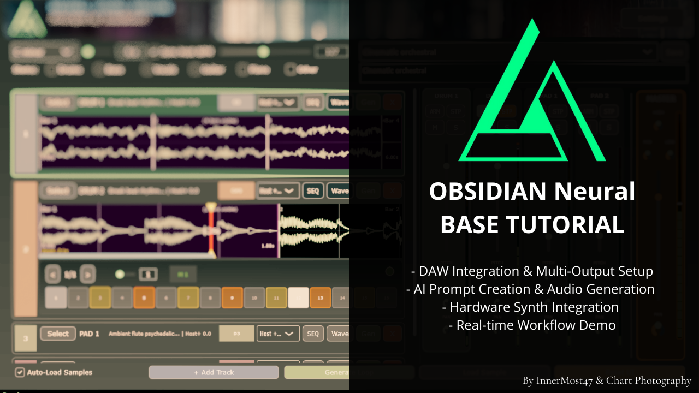
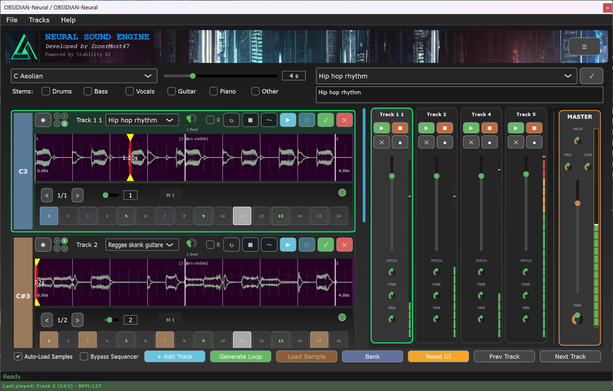

# OBSIDIAN-Neural

🎵 **Real-time AI music generation VST3 plugin for live performance**

### 🎓 **Base Tutorial**

[](https://youtu.be/-qdFo_PcKoY)

_Base OBSIDIAN-Neural workflow tutorial (French with English subtitles available) - from DAW setup to live performance with hardware synths!_

**Video created by [Chart Photography](https://chart-photography.fr/)**

**💡 Enable English subtitles or English audio dubbing on YouTube for international viewers**

---

**🎯 Want to see YOUR jam sessions featured here?**

I'm the only one posting live OBSIDIAN jams so far, and honestly... **I'm dying to see how YOU use it!**

Every AI-generated rhythm is different, sometimes weird, sometimes genius. That's the beauty - it forces you out of your comfort zone and into unexplored territory.

**Share your OBSIDIAN videos:**  
📧 Email me: b03caa1n5@mozmail.com  
💬 Or create a [Discussion](https://github.com/innermost47/ai-dj/discussions) with your YouTube link!

### 🔥 **Community Jam Sessions**

[](https://youtu.be/cFmRJIFUOCU)

_AI + analog gear jungle improvisation - when OBSIDIAN throws you curveballs and you roll with it!_

**📺 Check out all community jams → [YOUTUBE.md](YOUTUBE.md)**

Let's build a community of AI-human musical chaos! 🤖🎵

---

**📖 [Read the full story](https://medium.com/@innermost47/obsidian-neural-when-ai-becomes-your-jam-partner-5203726a3840) - Why I built an AI that jams with you in real-time**

---

## 🚀 **Installation Options**

### 📦 **Option 1: Local Models**

**🎉 Runs completely offline with local TensorFlow Lite models!**

**No more servers, Python, or GPU requirements!**

#### What You'll Need:

1. **Get Stability AI access**: [Request access](https://huggingface.co/stabilityai/stable-audio-open-small) to Stable Audio Open on Hugging Face
2. **Download models**: Get all files from [innermost47/stable-audio-open-small-tflite](https://huggingface.co/innermost47/stable-audio-open-small-tflite)
3. **Simple setup**: Copy models to `%APPDATA%\OBSIDIAN-Neural\stable-audio\`
4. **Launch**: Choose "Local Model" option

**✅ Benefits:** Completely offline, no GPU server, no Python installation, instant generation  
**⚠️ Requirements:** 16GB+ RAM recommended, Windows only initially

### ⚠️ **Current Limitations**

**The TensorFlow Lite models have some quality trade-offs:**

- **Timing issues**: Generated rhythms may not be perfectly quantized
- **Quality reduction**: TFLite quantization affects audio precision
- **High RAM usage**: Expect significant memory consumption during generation
- **Fixed duration**: Audio generation locked to 10 seconds (audiogen/TFLite limitation)
- **No STEMS separation**: DEMUCS stem separation not available in local mode

**For live performance and production use, the server-based approach still provides better quality, timing precision, variable duration, and STEMS separation.**

---

## 🎯 **Alternative Options (if local doesn't work for you):**

### 🚀 **Option 2: Beta Testing**

**Get FREE API access - No setup required!**

- Contact me for a free API key (**only 10 slots available**)
- Download VST3 from [Releases](https://github.com/innermost47/ai-dj/releases)
- **Contact:** b03caa1n5@mozmail.com

### 🔧 **Option 3: Build from Source (Self-Hosting)**

**Complete control with local server - for developers and advanced users!**

#### **Prerequisites:**

1. **Python 3.10+** installed from [python.org](https://python.org)
2. **Get Stability AI access**: [Request access](https://huggingface.co/stabilityai/stable-audio-open-1.0) to Stable Audio Open on Hugging Face
3. **Wait for approval**: Usually takes a few minutes to a few hours

#### **Installation Steps:**

**🪟 Windows:**

```bash
# Download the Python installer
# From releases: OBSIDIAN-Neural-Installer.py
python OBSIDIAN-Neural-Installer.py

# Alternative: Clone and build
git clone https://github.com/innermost47/ai-dj.git
cd ai-dj
python installer.py
```

**🍎 macOS:**

```bash
# Download from releases
# OBSIDIAN-Neural-Installer-macOS.dmg (recommended)
# OR OBSIDIAN-Neural-Installer-macOS.pkg (system-wide)

# Alternative: Use the executable
chmod +x OBSIDIAN-Neural-Installer-macOS
./OBSIDIAN-Neural-Installer-macOS
```

**🐧 Linux:**

```bash
# Download from releases
chmod +x OBSIDIAN-Neural-Installer-Linux
./OBSIDIAN-Neural-Installer-Linux

# Alternative: Build from source
git clone https://github.com/innermost47/ai-dj.git
cd ai-dj
python installer.py
```

**The installer automatically handles:**

- **Virtual environment creation**
- **All Python dependencies** (PyTorch, FastAPI, Stable Audio Tools, etc.)
- **AI model downloads** (Gemma-3-4B, 2.49 GB)
- **CUDA/ROCm detection** and installation (if GPU available)
- **VST3 compilation** (optional, requires build tools)
- **Configuration setup**

#### **Step-by-step workflow after installation:**

#### 1. **Launch Server Interface**

The installation creates a GUI control panel with:

**Server Interface Features:**

- **System Tray Support**: Minimize to tray with green triangle icon
- **🚀 Server Control Tab**: Real-time status, start/stop/restart buttons
- **⚙️ Configuration Tab**:
  - API Keys management with credit system (🔓 UNLIMITED, ✅ 50/50 credits)
  - Secure Hugging Face token storage with built-in verification
  - Model settings and server configuration
- **📝 Logs Tab**: Real-time server output with color-coded messages
- **First-Time Setup Wizard**: Guided configuration for new installations

#### 2. **Configure the Server**

- Launch the server interface: `python server_interface.py`
- **First launch**: Setup wizard will guide you through configuration
- **Hugging Face Token**: Enter your approved token (built-in verification available)
- **API Keys**: Generate keys with credit limits or unlimited access

#### 3. **Start the Server**

- Start the AI server from the GUI interface
- **API Keys prompt**:
  - **"Use stored API keys for authentication?"**
  - **Yes**: Use API authentication (for production/network access)
  - **No**: Development bypass - no auth needed (for localhost)
- **Server URL**: Will be displayed (usually `http://localhost:8000`)

#### 4. **Configure the VST**

- Download VST3 from [Releases](https://github.com/innermost47/ai-dj/releases) or build from source
- Load OBSIDIAN-Neural VST3 in your DAW
- **Server URL**: Paste from server GUI (e.g., `http://localhost:8000`)
- **API Key**: Copy from server interface (if using authentication)

**Troubleshooting:**

- **Windows users**: Python installer is the simplest approach
- **No Hugging Face access?** You must be approved for Stable Audio Open first
- **Build errors?** Download pre-compiled VST3 from releases instead
- **API confusion?** Choose "No" for simple localhost setup
- **Can't connect?** Make sure server is running before configuring VST

### 🎛️ **VST3 Downloads**

Pre-compiled VST3 plugins available for all platforms:

- **Windows**: `OBSIDIAN-Neural-Windows-VST3.zip`
- **macOS**: `OBSIDIAN-Neural-macOS-VST3.zip`
- **Linux**: `OBSIDIAN-Neural-Linux-VST3.tar.gz`

**Installation locations:**

- **Windows**: `C:\Program Files\Common Files\VST3\`
- **macOS**: `~/Library/Audio/Plug-Ins/VST3/` or `/Library/Audio/Plug-Ins/VST3/`
- **Linux**: `~/.vst3/` or `/usr/lib/vst3/`

---

**## 🎯 What OBSIDIAN-Neural Actually Does**

**Think of it as having an AI jam partner directly in your DAW.**

- **Type simple keywords** → AI generates musical loops instantly
- **Real-time generation** → No stopping your creative flow
- **8-track sampler with multi-page system** → Each track has 4 pages (A/B/C/D) for instant variation switching
- **MIDI triggering** → Play AI samples from your keyboard (C3-B3)
- **Perfect DAW sync** → Everything locks to your project tempo with intelligent time-stretching
- **Beat repeat & retrigger** → Built-in performance effects for live jamming
- **Stems separation** → Generate with isolated drums, bass, vocals, etc.
- **Sample bank** → Drag & drop your generated samples between tracks

**Example workflow:**

1. Type "dark techno kick" → AI generates a techno kick loop on page A
2. Switch to page B → Type "acid bassline" → Generate 303-style bass
3. Use keyboard shortcuts (Q-W-E-R) to switch between pages instantly
4. Trigger both with MIDI keys while jamming on hardware synths
5. Apply beat repeat for live performance effects

**It's like having a TB-303, but instead of tweaking knobs, you describe what you want in plain English. Plus you get 4 variations per track for endless creative possibilities.**

---

## 🌍 **Beyond the Plugin: A Different Approach to AI Music**

### 🏢 **Studio-Owned AI Models**

What if recording studios could create AI models based on their own recordings?

- Studios develop their unique AI signatures from decades of work
- Musicians access these signatures for their projects
- Revenue sharing creates new income streams for studios and session musicians
- AI becomes a collaborative tool with traceable musical heritage

**The concept:** Instead of generic AI trained on anonymous data, musicians could work with AI that carries the DNA of legendary studios like Abbey Road, or their local favorite recording space.

### 🌐 **Distributed GPU Network**

Current AI music generation requires expensive hardware that most musicians don't have.

**A potential solution:** Community-owned GPU network where:

- GPU owners share idle computing power
- Musicians get affordable access to AI generation
- Revenue gets distributed fairly among contributors
- Infrastructure stays independent from big tech

**Looking for volunteers** to help develop this distributed approach. If you have GPU resources or infrastructure expertise, let's discuss.

### 🤝 **Collaboration Over Replacement**

OBSIDIAN-Neural explores AI as a creative partner rather than a replacement for human musicians. The goal is building tools that enhance musical creativity while ensuring fair compensation for everyone who contributes to training these systems.

**Get involved:**

- **Studios**: Interested in exploring AI signature models?
- **GPU owners**: Want to contribute to a community network?
- **Musicians**: Have thoughts on ethical AI music tools?

Contact: b03caa1n5@mozmail.com

---

## 📰 **Press coverage moved to [PRESS.md](PRESS.md)**

---



---

## 🐛 Bug Reports & Feedback

**Found issues?** [Create GitHub Issue](https://github.com/innermost47/ai-dj/issues/new)

Include: DAW name/version, OS, steps to reproduce, expected vs actual behavior

---

## 📈 Project Status

🚀 **Local models**: Available now (with some limitations)
✅ **Server option**: Still the best for live performance
⚠️ **Pre-release**: Active development, frequent updates
🌟 **Star count**: 70+ - Thank you for the support!

---

## 📝 License

**OBSIDIAN-Neural** is dual-licensed to provide maximum flexibility for different use cases:

### 🆓 **Open Source License**

Mozilla Public License 2.0 (MPL-2.0) - Free for open source projects and commercial use. If you modify OBSIDIAN-Neural files, those modifications must remain MPL-2.0, but you can combine them with proprietary code in separate files.

### 💼 **Commercial License**

For organizations preferring proprietary licensing terms or requiring additional rights beyond MPL-2.0, commercial licenses are available.

**Contact for commercial licensing:** b03caa1n5@mozmail.com

### 🤝 **Why Dual Licensing?**

- **Open Source Community**: Full access to innovation with file-level copyleft protection
- **Commercial Users**: Flexibility for proprietary integration while protecting core innovations
- **Project Sustainability**: Commercial licenses fund continued development
- **License Compatibility**: MPL-2.0 is compatible with GPL, LGPL, and AGPL projects

**Attribution**: Please keep attribution to InnerMost47 in all cases.

---

## ⚖️ Disclaimer

**OBSIDIAN-Neural is provided "AS IS" without warranty of any kind.**

By using this software, you acknowledge that:

- You install at your own risk
- You are responsible for choosing appropriate installation paths
- The developer is not liable for any system damage or data loss
- You should have backups before installation
- You understand this is experimental software

**Installation Safety:** Always review installation paths carefully.
Avoid system directories like `/Applications`, `/System`, `C:\Windows`, etc.

---

## 🌐 More Projects

**Music & Creative Coding:**

- **[YouTube Channel](https://www.youtube.com/@innermost9675)** - Original compositions
- **[Unexpected Records](https://unexpected.anthony-charretier.fr/)** - Mobile recording studio
- **[Randomizer](https://randomizer.anthony-charretier.fr/)** - Generative music studio

**AI Art Projects:**

- **[AutoGenius Daily](https://autogenius.anthony-charretier.fr/)** - AI personas platform
- **[AI Harmony Radio](https://autogenius.anthony-charretier.fr/webradio)** - 24/7 experimental radio

---

**OBSIDIAN-Neural** - Where artificial intelligence meets live music performance.

_Developed by InnerMost47_
